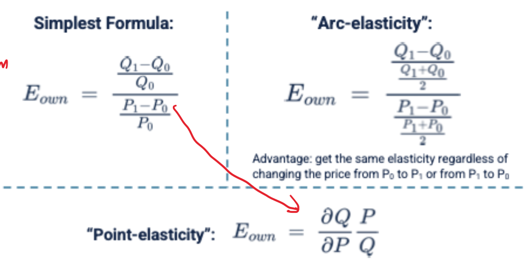
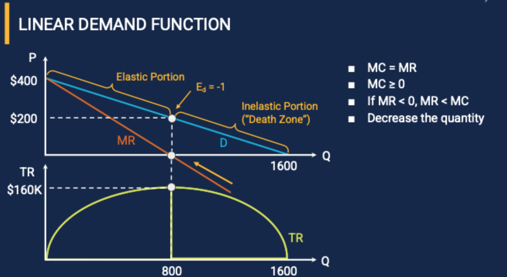
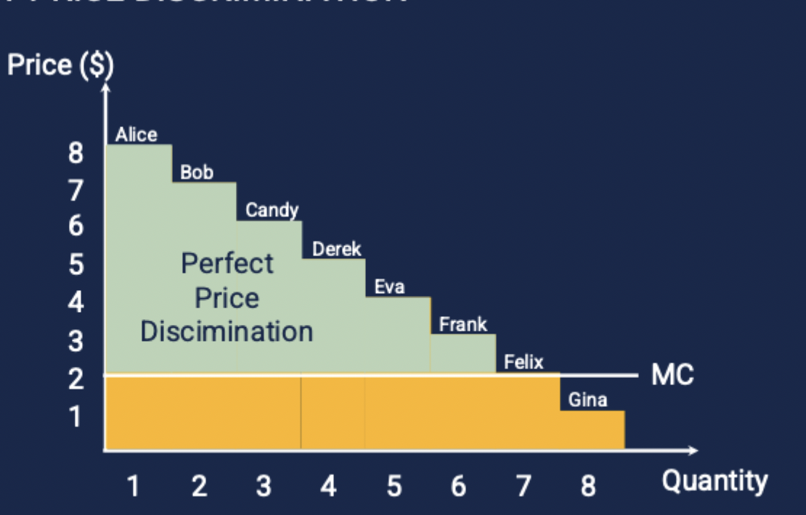

### Chapter 1

1. Opportunity cost is the next best alternative foregone when a choice is made.

### Chapter 2

Income Elasticity 
* E = % delta(Q) / % delta(Income)
  * If E < 0: Inferior food 
  * If E > 0: Normal food
  * If E > 1: Luxury food (Tesla)
**Law of Demand**: Elasticity is negative

Price Elasticity
* E = % delta(Q) / % delta(Price)
  * If E < -1: Elastic
  * If 0 > E > -1: Inelastic
  * If E = -1: Unit elastic

Calculating Elasticity

Cross Elasticity
* E = % delta(Q_own) / % delta(Price of other good)
  * If E > 0: Substitutes
  * If E < 0: Complements
  * When the value of E is large, the goods are close substitutes or complements.

Profit Maximization

* When MR > MC, increase production
* When MR < MC, decrease production
* When MR = MC, profit is maximized

Inverse Demand Function

>  P = a - bQ (Price on y-axis, Quantity on x-axis)

Marginal Revenue and Elasticity

* MR is the change in total revenue when one more unit is sold
> MR = P(1 + 1/|E|)

  * Perfectly Elastic: When E = infinity, MR = P
  * Elastic: When |E| > 1, 0 < MR < P
  * Unit Elastic: When |E| = 1, MR = 0
    * Maximizing revenue: MR = 0
  * Inelastic: When 0 < |E| < 1, MR < 0
  * Perfectly Inelastic: When E = 0, MR = - infinity

When in "dead zone" (inelastic portion), produce fewer unit to increase revenue and decrease cost.

Iso-elastic Demand: When elasticity is constant along the demand curve
  * You can use the elasticity to determine the new price when the quantity changes. 

### Chapter 3

Complex Pricing Strategies
* Goal: Reduce size of consumer surplus and unexploited market
* Perfect Price Discrimination (**1st-degree**): Charge each consumer their maximum willingness to pay

* Segment Pricing (**3rd-degree**): Charge different prices to different groups
  * Example: Software pricing for students, teachers, and businesses - Students are more price elastic
  * Example: Airline pricing for business and leisure travelers (5 day vs 14 day travel)
* Versioning(**2nd-degree**): Offering different versions of the same product at different prices
  * Example: Software versions (Basic, Pro, Enterprise)
  * Example: Barbie dolls with different accessories

Impediments to Price Discrimination
  * Arbitrage: Reselling goods at a higher price
  * Verification: Determining the consumer's willingness to pay
  * Regulation/Ethics (e.g - charging more for disadvantaged groups)
  * Customer anger (e.g. - Orbitz charging more for Mac users)

Volume Pricing: Two-part Tariff
  * Fixed fee + variable fee

Auction

* Tne power of incentive: Auctions can be used to determine the true willingness to pay

> Auction is the utimate tool for price discrimination

* Type of Auctions
  * Regular Auction: Competition is on buyer side (We focus on this!)
  * Reverse Auction: Competition is on seller side

* Private vs Common Value Auctions
  * Private Value: Value is different for each bidder
    * Example: Artwork, collectibles
    * Example: Meal at a restaurant
  * Common Value: Buyers agree on the good's value but have different estimates
    * Example: Oil drilling rights, spectrum auctions
    * Example: Jar of coins, where the value is the sum of the coins

* Auction Types
  * English Auction: Ascending price, last bidder wins
  * First-price Seal Auction: Sealed-bid, winner pays their bid
  * Second-price Seal Auction: Sealed-bid, winner pays the second highest bid
  * Dutch Auction: Descending price, first bidder wins

* Auction Assumptions
  * Private Value
  * Bidders are risk neutral
  * Bidders are rational

> The winner's curse: The winner of the auction is the one who overestimates the value of the good the most. (Win the auction, lose $$$)
 * Example: Zillow home buying policy using AI

### Chapter 4: Production Function

Short Run vs Long Run
* Short Run: At least one input is fixed (e.g. fixed capital)
* Long Run: All inputs are variable
* Marginal product of labor (MPL): Change in output when one more unit of labor is added
   * MPL = delta(Q) / delta(L)

Long-Run Returns to Scale
> Returns to scale: How output changes when **all** inputs are increased by a factor of k
  * Constant returns to scale: Output increases by k when all inputs are increased by k
     * If F(kL, kK) = kF(L, K)
  * Increasing returns to scale: Output increases by more than k when all inputs are increased by k
      * If F(kL, kK) > kF(L, K)
  * Decreasing returns to scale: Output increases by less than k when all inputs are increased by k
      * If F(kL, kK) < kF(L, K)

Fixed and Sunk Costs
* Fixed costs: Costs that do not change with output
* Sunk costs: A subtype of fixed costs that cannot be recovered

Total and Marginal Costs
* Total cost (TC): Fixed cost + Variable cost
* Marginal cost (MC): Change in total cost when one more unit is produced
  * MC = delta(TC) / delta(Q)
* You can use MC to determine price elasticity
  MC = P(1 + 1/|E|)
* MC curve intersects the ATC curve at the **minimum point of the ATC curve**
* When determine P, use the Demand curve to map the price

Economies of Scale
* Economies of scale: Average cost decreases as output increases
* Constant economies of scale: Average cost is constant as output increases
* Diseconomies of scale: Average cost increases as output increases

### Chapter 5: Market Structure

Perfect Competition
* Number of firms: Many
* Firms are **price takers**
* Barriers to entry: No
* Long-run profit: No

> MR = P = MC
* Demand curve is horizontal, at the market price

Whether to operate or shut down in short run (Assuming all fixed costs are sunk)
* If P < AVC, shut down
* If P > AVC, operate

Whether to enter or exit in long run [Demand = MR = MC = ATC = P - No firm wants to enter or exit]
* If P > ATC, enter
* If P < ATC, exit

Competitive Equilibrium
* Equilibrium only if no existing firms want to enter or exit
* Each firm producing at its minimum ATC [MC crosses ATC at the minimum point]

Barrier to Entry
* Patents
* Economies of scale
  * Natural monopoly: One firm can produce at a lower cost than multiple firms (PG&E)
* Control of essential resources
  * Champagne, tequila
* Brand Recognition
  * Q-tips, Kleenex
* Lobbying
  * Intuit lobbying against TurboTax free filing

Switching Costs

* Example: If Samsung wants customer to switch from iPhone to Samsung, they need to offer a lower price, so that customer surpluses are equal

Regulartion: Tax
* Tax incidence: Who bears the burden of the tax. This is different to tax remittance, which is who pays the tax to the government.
  * The **most inelastic side** bears the most burden of the tax
    * Example: If demand is more inelastic than supply, consumers bear more of the tax burden
    * Example: When supply is perfectly inelastic, the entire tax burden is borne by consumers

Regulation: Minimum Wage Regulation

* If min wage is above equilibrium wage, some workers will lose their jobs yet some will benefit
* Circumvention:
  * Cutting Benefits
  * Informal Labor

### Chapter 6: Monopoly

Monopoly
* Price searcher: Monopolist can set the price
* Barriers to entry: Yes
* Long-run profit: Yes
* Number of firms: One

Cournot Competition
* In a duopoly, firms are selling a homogenous product. They decide how much to produce and the price is determined by the market
* Assuming marginal cost is constant, the equilibrium is where the two firms' reaction curves intersect

Bertrand Competition
* In a duopoly, firms are selling a homogenous product. They decide how much to charge and the quantity is determined by the market
* At the end, both firms' price is equal to the marginal cost and the firms make zero profit

Monopolistic Equilibrium
* Monopolist produces where MR = MC
* Monopolist charges where demand curve intersects MR curve

