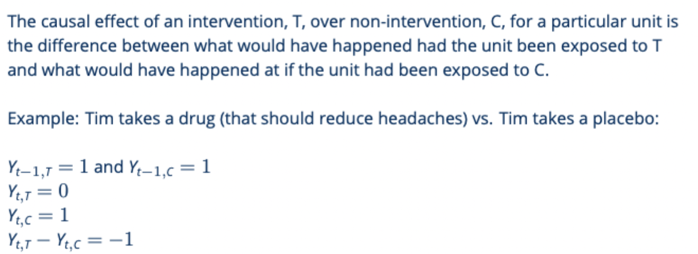
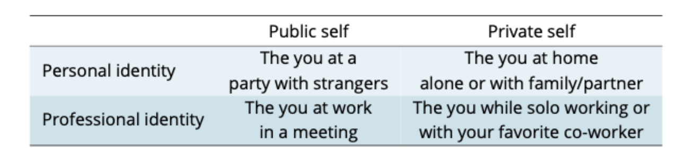
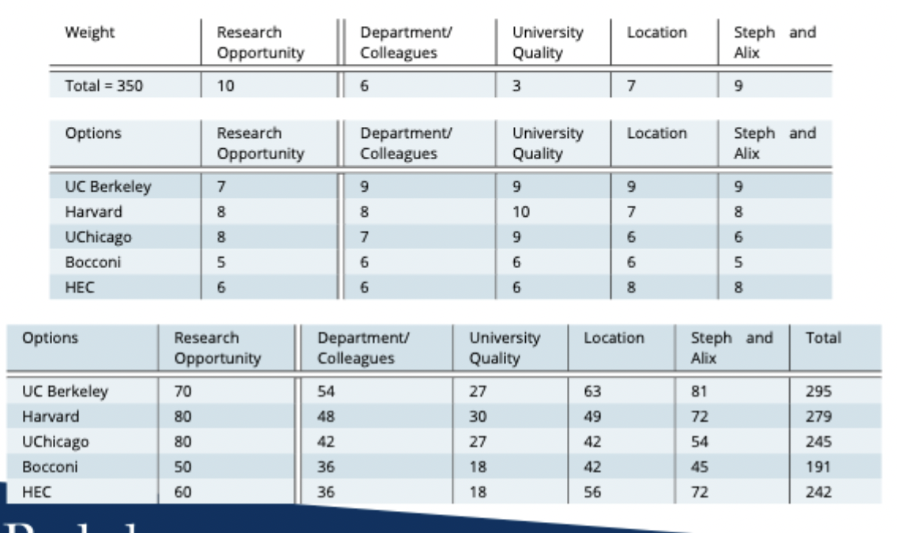
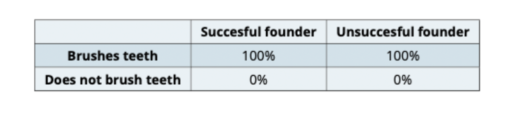
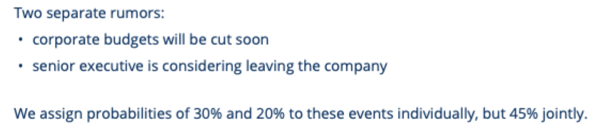
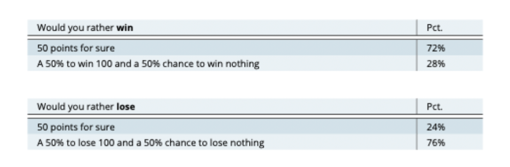
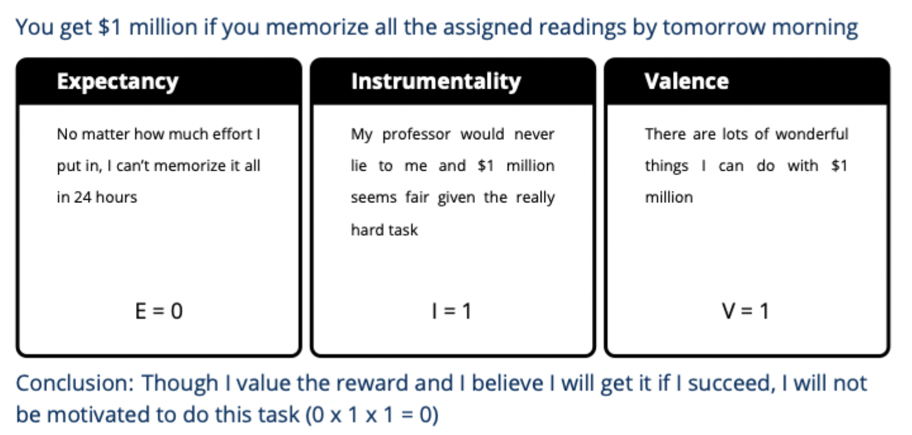

# Haas Leading People Midterm

## Week 1: Introduction

### Management vs. Leadership
> Good management and leadership will better align employee incentive and organizational goals.
* Manager != Leader, becoming a good leader might require being a good manager.

### Important Leadership Features
* Employment Engagement: achieving organizational, retaining talent, and building a positive workplace culture.
* Innovation: Creativity, experimentation, and continuois learning within the organization.
* Transparency: Making decisions transparently and inclusively 
* Strong organizational culture: Strong, supportive and collaborative culture.

### Data and Evidence

* Causal Inference: Establishing a cause-and-effect relationship between variables.
  * e.g. Medical trials
* Prediction: Predict the outcome accurately without establishing underlying causal  relationship.
  * e.g. Demand forecasting

### Experimental Design

* Research participants: **Randomly(hallmark)** assign participants to treatment and control groups.
  * If for practical reasons, random assignment is not possible, use **quasi-experimental** design.
* Independent variable: The variable that is manipulated in experiment.
* Dependent variable: The variable that is measured in experiment.

  * Unfortunately,  we can never observe the same unit under both treatment and control conditions at the same time.
To make the causal inference possible, we compute an average treatment effect (ATE) by studying a sample of subjects each of which was **randomly** assigned to either treatment or control group.

**The risk of confounding variables**: Variables that are correlated with both the treatment and the outcome.

### Challenges in Experimental Design

* Small sample size: Reduces the statistical power of the experiment.
  * Solution: Conduct a power analysis to determine the sample size needed to detect the effect of interest.
* Non-Compliance: Dilutes the treatment effect.
  * Solution: Monitoring, compliance incentives, and intention-to-treat analysis.
* Contamination: When the control group is exposed to the treatment. This can obscure the difference.
  * Solution: Physical separation and ensure clear communication about the treatment.
* **Hawthorne Effect**: When participants change their behavior because they know they are being observed.
  * Solution: Use a placebo group or a double-blind experiment.
* Attrition: High dropout rate can bias the results, especially if the attrition rates differ between treatment and control groups.
  * Solution: Use intention-to-treat or follow up protocals. 
* Short-Duration: The treatment effect may not be observable in the short term.
  * Solution: Be explicit about the time horizon of the study and consider long-term effects.

## Week 2: Know Yourself and Others

Goal
> Know yourslf and your cognitive biases.
> Understand other people's personalities and cognitive biases.

**Dispositionism**: The tendency to attribute behavior to internal factors such as personality traits rather than external factors.

**Neuroticism**: The tendency to experience negative emotions such as anxiety, depression, and anger.
  * The big five model captures neuroticism

### The big Five Personality Traits

1. Extroversions: Outgoing, social, and assertive.
   * HIgh extroversion is associated with leadership emergence --> Manager/Sales People.
2. Agreeableness: Good-natured, cooperative, and warm.
   * High agreeableness is associated with positive relationships, gratitude, and forgiveness --> Volunteer in community.
3. Conscientiousness: Responsible, dependable, and organized.
    * High conscientiousness is associated with job performance and extrinsic motivation --> Accountant.
4. Openness to Experience: Creative, curious, and imaginative.
    * High openness has been found to contribute to one's likelihood pf obtaining leadership positions. 
5. Emotional Stability: Calm, secure, and self-confident.

> Big 5 personality traits are fundamental core personality features to understand individual differences in behavior. 
  * Other tests give you a type while big five put you in a scale of 1-5 for each trait.

> However, they should NOT BE a driver of hiring or promotion decisions.

### Authenticity 
> Dispositionisn and situationism meet at authenticity.

**Situationism**: The belief that behavior is determined by situational factors like immediate environment and social context (e.g Work Environment).

**Authenticity**: Alignment between one's inner feelings and your expressed behavior.
  * Can be a self-focused judgement or other-focused judgement, but they are not always aligned.

The Authenticity Paradox: Leaders need to adapt to new roles without losing their sense of self, but flexibility is essential for growth

* Self-perceived authenticity: The extent to which you feel authentic.
  * rubust predictor of self-esteem, life satisfaction, and well-being.
  * higher engagement and job satisfaction.
* Other-perceived authenticity: The extent to which others perceive you as authentic.
  * stakeholder perceptions of leadership effectiveness, employee engagement, and org culture.

### Takeaways
1. Personality tests can be useful for self-awareness, but have accuracy and inclusivity limitations.
2. The Big Five and Dark Side traits provide a framework for understanding workspace behavior.
3. We contain a multitude of selves, which can generate authenticity challenges.
4. You can be true to yourself and adapt to your environment.

## Week 3: Decision Making

### Rational Approach 
* **Boundary rational**: People are not infinitely rational, but they are rational within the boundaries of their cognitive limitations.
* Satisfice: People make decisions that are good enough, rather than optimal.

### MAUT: Multi-Attribute Utility Theory
1. Identify the decision criteria.
2. Assign weights to the criteria.
3. Score each option on each criterion.
4. Multiply the scores by the weights and sum them up and rate
5. Choose the option with the highest score.

> **Decision making bias**: 1. confirmation bias, 2.availability 3. representativeness.

### Confirmation Bias
Tendency to seek out information that confirms our beliefs and ignore information that contradicts them.
1. **Confirmation trap**: Seeking out information that confirms our beliefs.
  * e.g. M&A: Buyers gather data to support their decision to buy and overlook data that suggests otherwise.
  * e.g. Personnel decisions: Managers focus on the positive aspects of a candidate and ignore the negative aspects.
  * e.g. Product management: Look for sign that things are going well and ignore signs that things are going poorly.

-------- What do we do ----------------
* Personal: Ask yourself what you might be wrong. Actively **seek out disconfirmatory** evidence.

* Organizational: 
  * Reward decision making process not just outcomes.
  * instututionalize dissent.

2. Sampling on dependent variable: Only looking at the data that supports our hypothesis.  
  * e.g. Successful founders brush their teeth, so brushing teeth is a key to success.
-------- What do we do ----------------
* Is it plausible that subjects not included in the sample exhibit the same behavior?
* Are all 4 cells of the 2x2 table filled?

3. **Egocentrism/Overconfidence**: Overestimating our own abilities and knowledge, which is greater than the objective accuracy of those abilities.

##### Better-than-average effect

BTAE is larger:
* personality traits
* positive dimensions
* simple, familiar tasks and tasks relevant to self-identity
-------- What do we do ----------------
* Personal: 
  * Practice perspective-taking.
  * Work on self-awareness by incorporating external tools and "helpful" comparisons.

### Availability
Tendency for people to based judgements on recent or readily available information and pay little attention to relevant historical data. 
* Retrievability: memory structure affect the search process 
  * e.g. Recent performance holds undue weight in performance evaluations.
* Ease of recall: Making decision based on vividness of information.
  * e.g. Annual fatalities from shark attacks are 10x less than fatalities from falling coconuts, but people are more afraid of sharks.
* Anchoring: Paying attention to irrevant "anchors" when making decisions.
  * e.g. Real estate agents use the listing price as an anchor.

### Representativeness
Tendency to assume a member of a group has the same characteristics as the group itself.
* e.g. Assuming a person who is a vegetarian is also an environmentalist.

**Conjunction fallacy**: Assuming that the conjunction of two events is more likely than one of the events alone.
  * e.g. Linda is a bank teller and is active in the feminist movement. Is it more likely that Linda is a bank teller or a bank teller and a feminist?

-------- What do we do ----------------
* Collect good data and avoid assuming casual relationships.
* Bring people together use collective intelligence.

### Framing 
The way information is presented can influence decision making.

> Losts are more painful than gains are pleasurable.
* People are risk-averse when the outcome is framed in terms of gains.
* People are risk-seeking when the outcome is framed in terms of losses.

-------- What do we do ----------------
* Personal: 
  * Consider the framing of the decision.
  * Use a structured decision-making process.

* Organizational:
  * Use a structured decision-making process.
  * Motivate towards change and risk: use loss frame ()
  * Motivate towards stability and security: use gain frame 

## Week 4: Movitation at Work

### Expectancy Theory
People are motivated to act in a certain way because they expect a particular outcome.
> Motivation = Expectancy x Instrumentality x Valence
* Expectancy: Effort -> Performance
* Instrumentality: Performance -> Outcome
* Valence: Outcome -> Satisfaction

### Feedback not easy

Challenge
* illusion of transparency: overestimating how well others understand our thoughts and feelings.
* Sugarcoating: Softening the feedback to avoid hurting the recipient's feelings.
  * Feedback sandwich: Positive feedback -> Negative feedback -> Positive feedback
* Not specific enough: Vague feedback is not actionable.

Positive vs Negative Feedback
* Positive feedback: Reinforces good behavior and increases motivation. Works best for those not fully committed to the task.
* Negative feedback: Corrects mistakes and improves performance. Works best for those who are already committed to the task.

> Feedback should be provided frequently, specific, and actionable.

### Rewards

1. Intrinsic vs Extrinsic motivation
* Intrinsic motivation: Motivation that comes from within.
  * e.g. Enjoying the task, feeling of accomplishment.
* Extrinsic motivation: Rewards that have no effect on how enjoyable the task is.
  * e.g. Money, praise, promotion.

> Extrinsic rewards may erode intrinsic motivation.
> If someone is already intrinsically motivated, extrinsic rewards may reduce their motivation.

2. Immediate vs Delayed rewards

Immediate rewards are more effective than delayed rewards.

### Job Crafting 

1. Task crafting: Changing the number, type, or nature of tasks.
2. Relational crafting: Changing the number, type, or nature of relationships; style of interaction.
3. Cognitive crafting: Changing the way you perceive the job.

### Motivation and fairness

**halo effect**: The tendency to assume that someone who is good at one thing is good at everything.

**input bias**: The tendency to overestimate the effort we put into a task.

Good reward system can be spoiled by perceived unfairness, a lack of attetion and lack of promised delivery.

## Week 5: Teamwork 

### How team operate
1. Divide and conquer
2. Aggregate information
  * wisdom of the crowd: the collective opinion of a group of individuals is often more accurate than that of a single expert.
  * **social loafing:** the tendency of individuals to exert less effort when working in a group than when working alone.
3. Expertise 
  * **groupthink**: the tendency of group members to conform, resulting in a narrow view of the problem.

